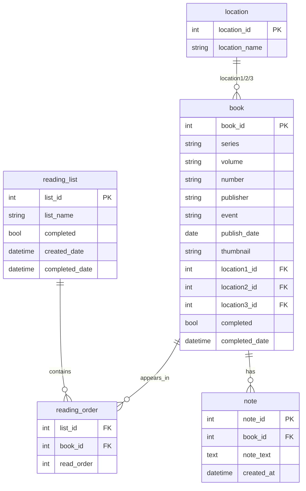

# Reading List App — Project Plan

A personal (single-user) app with three pieces sharing one Supabase database:

1. **Data backend** — Postgres schema + RPC functions, secured with RLS and a shared write secret.
2. **Browser extension** — Edge + Firefox (desktop), scrapes comic data from target sites and adds books to a chosen list.
3. **Reading List web page** — responsive UI for viewing, reordering, and editing lists on desktop and mobile.

**Live deployment:** [comic-reading-list.mpnrfphs6d.workers.dev](https://comic-reading-list.mpnrfphs6d.workers.dev) (Cloudflare Pages, git-connected to GitHub)

---

## Architecture decisions (resolved)

| Layer | Choice | Status |
|---|---|---|
| Database + API | **Supabase** (Postgres + PostgREST + RPC) | ✅ In use |
| Web app | **React + Vite + TypeScript** on **Cloudflare Pages** | ✅ Deployed |
| Source control | **GitHub** (`KdHardy/comic-reading-list`) | ✅ In use |
| Auth model | Shared write secret (no user login) | ✅ Implemented via RPC `_check_secret` |
| Revert semantics | Autosave per interaction + snapshot revert on page load | ✅ Implemented |
| Offline viewing | Paused — remote mobile access is the priority | ⏸ Deferred |
| Extension platforms | Edge + Firefox desktop only for now | ✅ Implemented |

GoDaddy shared hosting and local XAMPP were considered early on; **Supabase + Cloudflare Pages** was chosen instead for a $0/mo stack with a real API and mobile-friendly hosting.

---

## Data model

### Migrations applied

| File | Purpose | Status |
|---|---|---|
| `0001_init_schema.sql` | Core tables, location seed data, dedupe index | ✅ |
| `0002_functions.sql` | RPC functions (`add_book_to_list`, `reorder_list`, etc.) | ✅ |
| `0003_security.sql` | RLS policies (SELECT-only for anon) | ✅ |
| `0004_remove_book_from_list.sql` | `remove_book_from_list` RPC + revert upsert fix | ✅ |
| `0005_notes.sql` | `note` table + `add_note` / `update_note` / `delete_note` RPCs | ✅ |

---

## Feature checklist

### Infrastructure

- [x] GitHub repository
- [x] Supabase project with migrations applied
- [x] Cloudflare Pages git-connected deployment
- [x] Supabase MCP configured in Cursor for direct SQL/migrations

### Web app — Reading List page

- [x] List picker dropdown + create new list
- [x] Remember selected list across page refresh (`localStorage`)
- [x] Editable list title (pencil / confirm / cancel, blank-title guard)
- [x] Book rows: complete checkbox, up/down reorder, drag reorder (`@dnd-kit`, touch-aware)
- [x] Thumbnail, title (`{Series} (Vol {Volume}) #{Number}`), publisher + date
- [x] Location 1 and Location 2 dropdowns (from `location` table)
- [x] Location 3 data field kept in DB but hidden from UI
- [x] Per-book notes: scrollable list, `+` to add, click-to-edit, URL linkify, Ctrl+Enter to save
- [x] Delete button per row (`remove_book_from_list`)
- [x] Revert button (snapshot taken at page load, restores via `revert_list` RPC)
- [x] Autosave on every interaction (complete, reorder, location, title, notes)
- [x] Auto-refresh when tab becomes visible + 20s polling (picks up extension changes)
- [x] Responsive layout for desktop and mobile
- [ ] Automated tests

### Browser extension

- [x] Manifest V3 scaffold (separate Chrome/Edge and Firefox manifests)
- [x] Options page for Supabase URL, anon key, write secret
- [x] Popup: list picker, pending queue, Submit / Cancel
- [x] Inline "create new list" UI (no separate prompt window)
- [x] Capture mode button ("Add Comic from Page") — boxes on list pages, click-anywhere on detail pages
- [x] Remember last-selected list across popup open/close (`lastListId` in storage)
- [x] Persist pending queue to storage (survives service worker restarts)
- [x] Reliable submit: retries, partial-failure handling, duplicate-submit guard
- [x] Six site adapters (see table below)
- [ ] iPad Safari extension research (not started)

### Site adapters

| Adapter | Page types | Status |
|---|---|---|
| `comicBookHerald.js` | List (blog reading orders) | ✅ Verified; plain-text bullets supported |
| `leagueOfComicGeeks.js` | List + detail | ✅ Fixed against live DOM (2021 new-comics pages, issue detail) |
| `hoopla.js` | Detail | ✅ Fixed (`/comic/` URL pattern, live selectors) |
| `amazonComixology.js` | Detail | ⚠️ Best-effort — verify on live Amazon pages |
| `marvelUnlimited.js` | Detail (public marvel.com pages) | ⚠️ Best-effort — targets public issue pages, not authenticated reader |
| `dcUniverseInfinite.js` | Detail (public dc.com pages) | ⚠️ Best-effort — targets public issue pages, not authenticated reader |

---

## Implementation history

Work was built in roughly this order (matching the original suggested implementation order, with additions along the way):

1. **Infra** — GitHub repo, Supabase project, local dev environment.
2. **Schema + API** — migrations 0001–0003, shared-secret RPC writes, RLS.
3. **Reading List page** — core UI, reorder, revert, responsive layout.
4. **Extension scaffold** — popup, background worker, messaging, first adapters.
5. **Extension capture mode** — replaced eager button injection with on-demand capture flow.
6. **Adapter fixes** — League of Comic Geeks list pages, Hoopla detail pages, Comic Book Herald plain text.
7. **Delete from list** — migration 0004, trash button on each row.
8. **Cloudflare deployment** — git-connected Pages/Workers deploy; env var troubleshooting.
9. **Notes feature** — migration 0005, `NoteList` component, embed key fix (`notes:note` alias).
10. **Reliability pass** — extension pending persistence + submit retries; web list memory + auto-refresh.

---

## Open / future work

| Item | Notes |
|---|---|
| **iPad Safari extension** | Firefox iOS has no extensions. Safari Web Extensions require Xcode packaging/signing. Research only — not started. |
| **Offline viewing** | Paused. Remote mobile edit/read via Cloudflare Pages is working. PWA caching or export could be a later phase. |
| **Authenticated Marvel/DC adapters** | Current adapters target public marketing pages. Rebuilding against logged-in reader UIs would need live DOM inspection while authenticated. |
| **Amazon/Comixology adapter verification** | Selectors are best-effort; verify against a live product page. |
| **Automated tests** | None yet. |

---

## Original spec reference

The full original spec (database field definitions, extension popup controls, row layout, submit logic, and target site list) was provided at project kickoff. The implementation follows that spec with these documented deviations:

- **Security:** writes go through Postgres RPC functions checking a shared secret, not Supabase Edge Functions (simpler, same effect for solo use).
- **Location 3:** kept in the database but hidden from the web UI (notes panel uses that space instead).
- **Notes:** added post-spec — per-book text blurbs with optional URLs, not in the original spec.
- **Capture mode:** replaced the original per-page "add button" injection with an extension-popup-initiated capture flow.
- **Delete from list:** added post-spec — per-row trash button with `remove_book_from_list` RPC.
